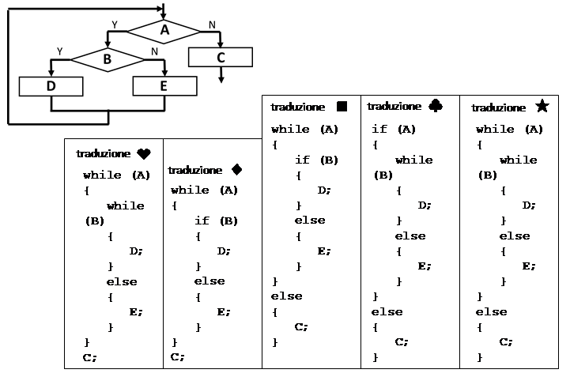
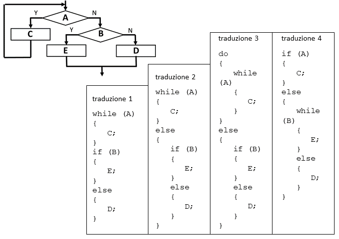
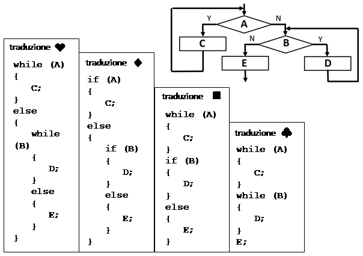

# Programmazione strutturata /01

---

## Dette A, B, C, ecc. le condizioni e istruzioni rappresentate nel seguente diagramma di flusso, si indichi la corretta traduzione in forma testuale: 

- [ ] traduzione 1
- [x] traduzione 2
- [ ] traduzione 3
- [ ] traduzione 4
- [ ] traduzione 5
- [ ] Il diagramma di flusso non è strutturato e quindi non può essere tradotto in forma testuale

---

## Dette A, B, C, ecc. le condizioni e istruzioni rappresentate nel seguente diagramma di flusso, si indichi la corretta traduzione in forma testuale: 

- [x] traduzione 1
- [ ] traduzione 2
- [ ] traduzione 3
- [ ] traduzione 4
- [ ] Il diagramma di flusso non è strutturato e quindi non può essere tradotto in forma testuale

---

## Dette A, B, C, ecc. le condizioni e istruzioni rappresentate nel seguente diagramma di flusso, si indichi la corretta traduzione in forma testuale: 

- [ ] traduzione 1
- [ ] traduzione 2
- [ ] traduzione 3
- [x] traduzione 4
- [ ] Il diagramma di flusso non è strutturato e quindi non può essere tradotto in forma testuale

