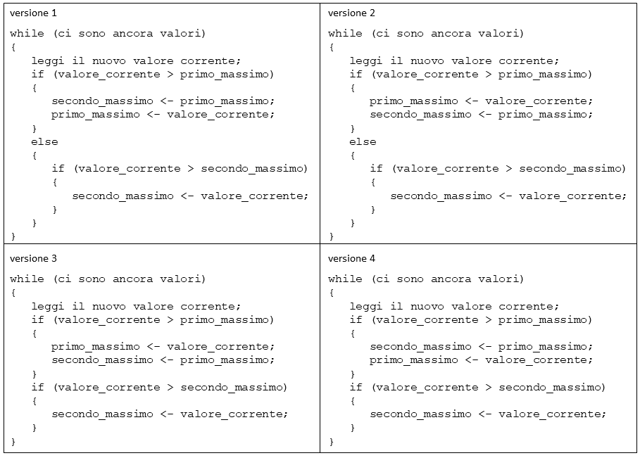
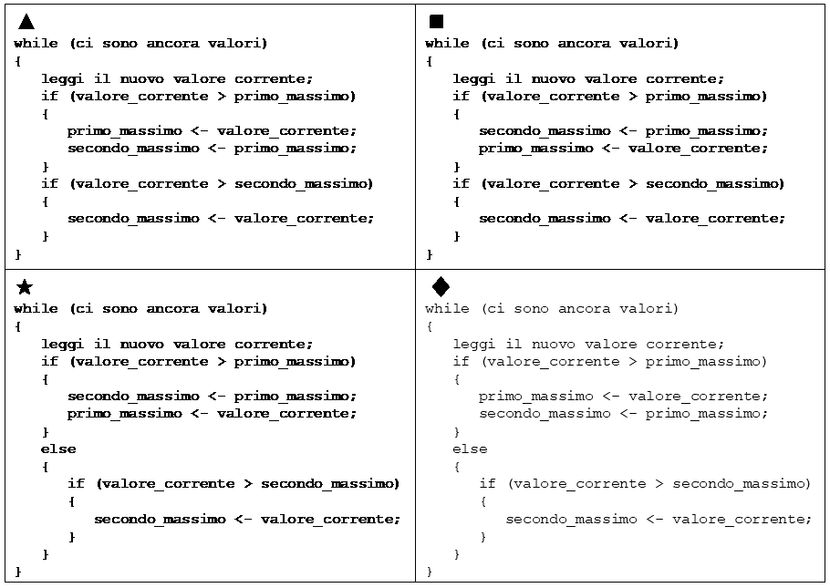
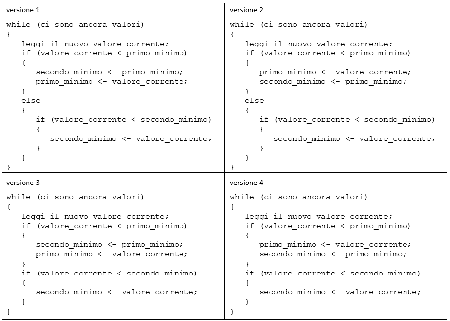
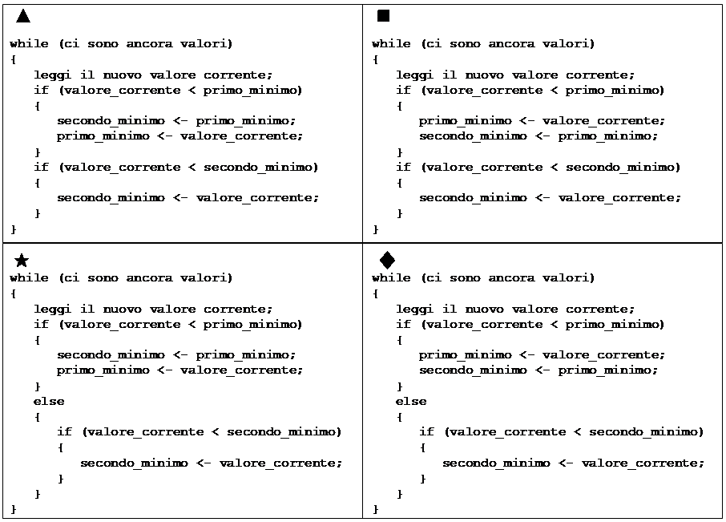

# Algoritmi /01

---

## Il seguente segmento di codice deve calcolare il primo e il secondo massimo di una sequenza di valori. Si indichi la versione corretta.

- [x] versione ▲
- [ ] versione ◼️
- [ ] versione ★
- [ ] versione ♦
- [ ] nessuna delle versioni è corretta

---

## Il seguente segmento di codice deve calcolare il primo e il secondo massimo di una sequenza di valori. Si indichi la versione corretta.

- [ ] versione ▲
- [ ] versione ◼️
- [x] versione ★
- [ ] versione ♦
- [ ] nessuna delle versioni è corretta

---

## Il seguente segmento di codice deve calcolare il primo e il secondo minimo di una sequenza di valori. Si indichi la versione corretta.

- [ ] versione ▲
- [x] versione ◼️
- [ ] versione ★
- [ ] versione ♦
- [ ] nessuna delle versioni è corretta

---

## Il seguente segmento di codice deve calcolare il primo e il secondo minimo di una sequenza di valori. Si indichi la versione corretta.

- [ ] versione ▲
- [ ] versione ◼️
- [ ] versione ★
- [x] versione ♦
- [ ] nessuna delle versioni è corretta
